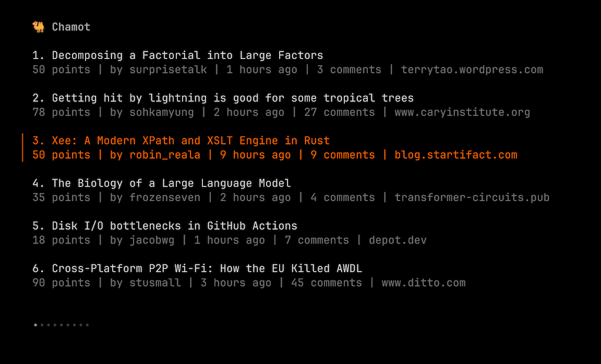
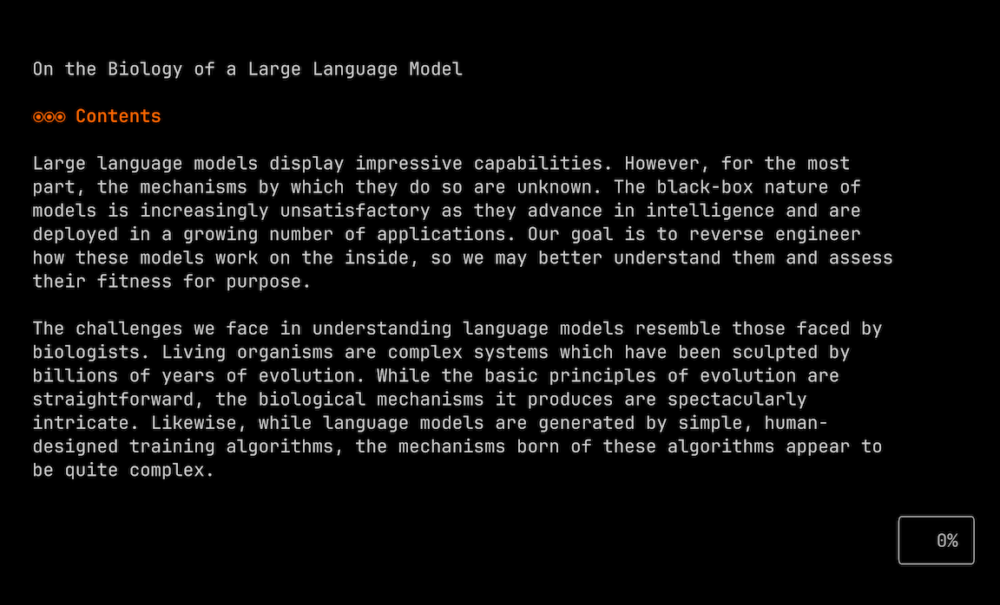
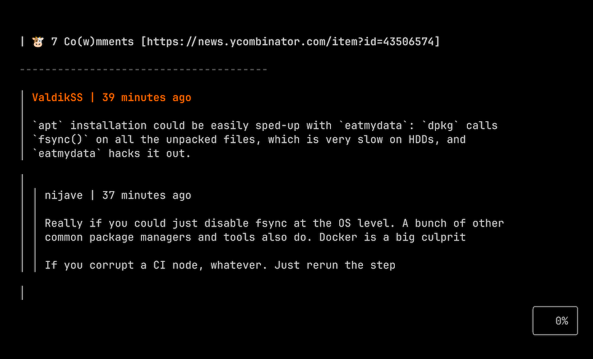
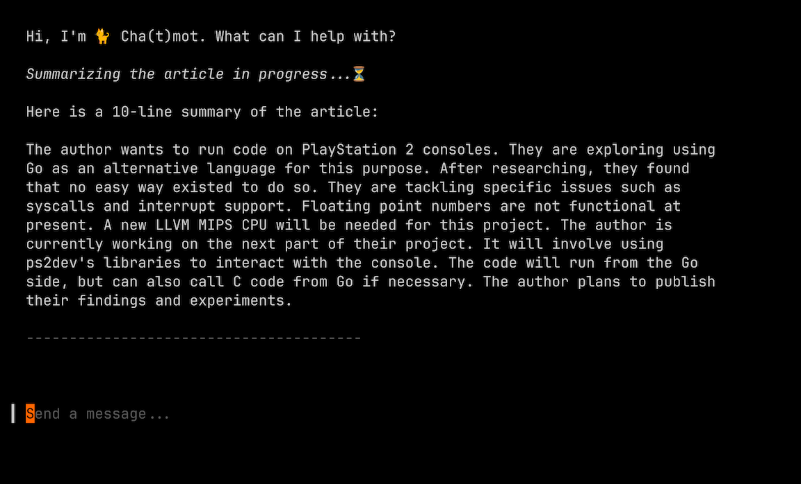

# Chamot, Lightweight and LLM-powered Hacker News Terminal App

[](https://github.com/lascauje/chamot/actions/workflows/chamot_build.yml)


## 🚀 Features

- 💻 Vim-like Keymaps
- 🌈 Elegant Markdown Rendering
- 🌍 Hacker News Stories, Comments, and Articles
- 🦙 Ollama for Instant Insights

## 🌟 Showcase


### Story



| Command  | Description |
|----------|-------------|
| `j`      | Move Down |
| `k`      | Move Up |
| `d`      | Half-page Down |
| `u`      | Half-page Up |
| `g`      | Go Top |
| `G`      | Go Bottom |
| `Enter`  | Show Article |
| `Space`  | Show Comment |
| `o`      | Open Chat |
| `s`      | Summarize Article |
| `Ctrl-c` | Quit App |

### Article



| Command  | Description |
|----------|-------------|
| `j`      | Move Down |
| `k`      | Move Up |
| `d`      | Half-page Down |
| `u`      | Half-page Up |
| `g`      | Go Top |
| `G`      | Go Bottom |
| `Ctrl-x` | Previous View |
| `Ctrl-c` | Quit App |

### Comment



| Command  | Description |
|----------|-------------|
| `j`      | Move Down |
| `k`      | Move Up |
| `d`      | Half-page Down |
| `u`      | Half-page Up |
| `g`      | Go Top |
| `G`      | Go Bottom |
| `Ctrl-x` | Previous View |
| `Ctrl-c` | Quit App |

### Chat



| Command  | Description |
|----------|-------------|
| `Enter`  | Send Message |
| `Ctrl-]` | Cancel Response |
| `Ctrl-d` | Half-page Down |
| `Ctrl-u` | Half-page Up |
| `Ctrl-x` | Previous View |
| `Ctrl-c` | Quit App |

## 📦 Quickstart

### Get Ollama

```bash
❯ curl -fsSL https://ollama.com/install.sh | sh
❯ ollama serve
❯ ollama run llama3.2:1b
```

> [!NOTE]
>
> Chamot can be used without Ollama running.

### Run Chamot

```bash
❯ curl -L -o chamot.tar.gz https://github.com/lascauje/chamot/archive/refs/tags/v0.1.0.tar.gz && tar -xzf chamot.tar.gz && cd chamot-0.1.0
❯ go run main.go
```

> [!NOTE]
>
> Please refer to the `.env` file and adjust it according to your needs.
>
> Ensure that the `OLLAMA_MODEL` variable matches the name of the running Ollama model.

## 🌴 Under the Hood

- [bubbletea](https://github.com/charmbracelet/bubbletea), [html-to-markdown](https://github.com/JohannesKaufmann/html-to-markdown), [go-readability](https://github.com/go-shiori/go-readability)
- [hacker news api](https://github.com/HackerNews/API)
- [ollama](https://github.com/ollama/ollama)
- [vhs](https://github.com/charmbracelet/vhs)
